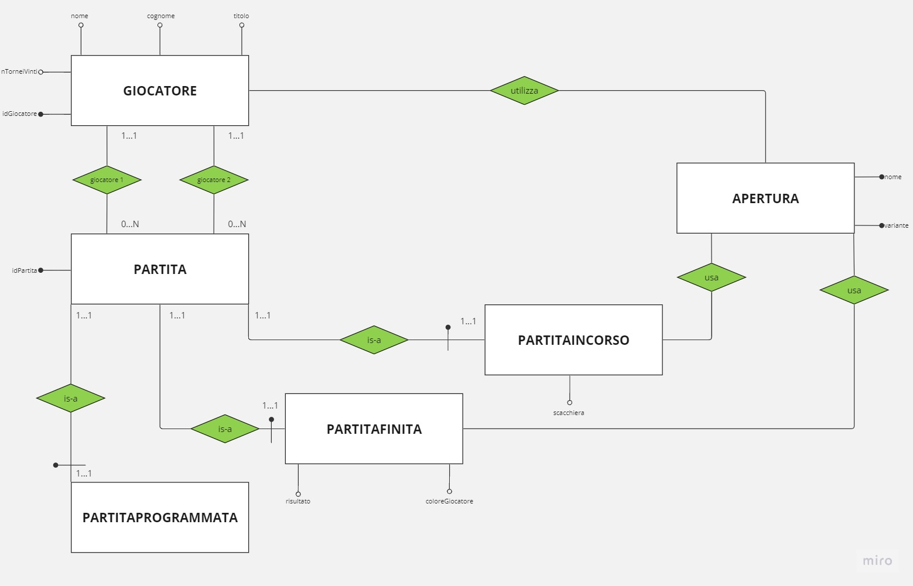

**TORNEO DI SCACCHI**
RICHIESTA:
Si vuole progettare una base di dati per gestire un torneo di scacchi.
--------------------------------------
Analisi: 
Dobbiamo creare uno schema er che possa gestire le partite di scacchi programmate, in corso e finite. Oltre alle partite dobbiamo anche salvare i giocatori e le aperture.
---------------------------------------
Entità che voglio usare:
1. giocatore: nome, cognome, titolo, nTorneiVinti, idGiocatore; 
*Chiave*: idGiocatore;
2. partita: idPartita, giocatore.idGiocatore(giocatore 1), giocatore.idGiocatore(giocatore 2);
*Chiave*: idPartita;
3. partitaFinita: coloreGiocatore, risultato, partita.idPartita;
*Chiave*: (FK) idPartita;
4. partitaProgrammate: partita.idPartita;
*Chiave*: (FK) idPartita;
5. partitaInCorso: scacchiera (rappresentato in una stringa), partita.idPartita;
*Chiave*: (FK) idPartita;
6. apertura: nome, variante;
*Chiave*: (composta) nome, variante;
-------------------------------------
Esempio:
Magnus Carlsen (GM che ha vinto 500 tornei) giocherà questo sabato contro Levy Rozman (IM che ha vinto 100 tornei).
Quando la partita sarà in corso, il database sarà costantemente aggiornato con la posizione della scacchiera, rappresentata da una stringa divise in righe nelle quali troviamo il nome del pezzo e la posizione divisi da uno spazio, e salverà il nome delle aperture quando sarà finita la teoria.
Quando la partita sarà finita, salveremo le aperture (se ci sono state abbastanza mosse, e uno dei giocatori non si è arreso dopo la pima mossa), il risultato e il colore di uno dei giocatori.
-------------------------------------
SCHEMA ER:

